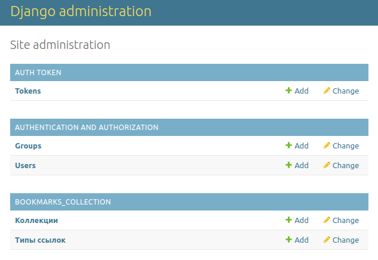
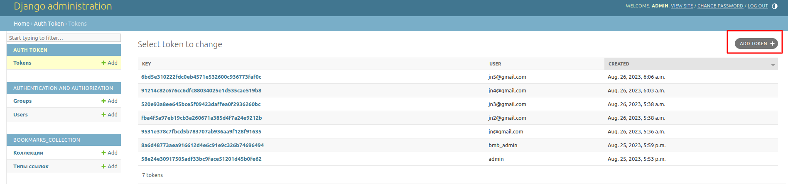
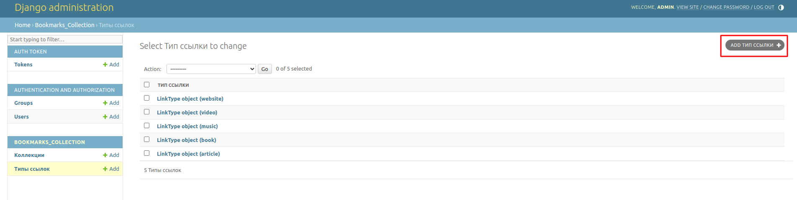
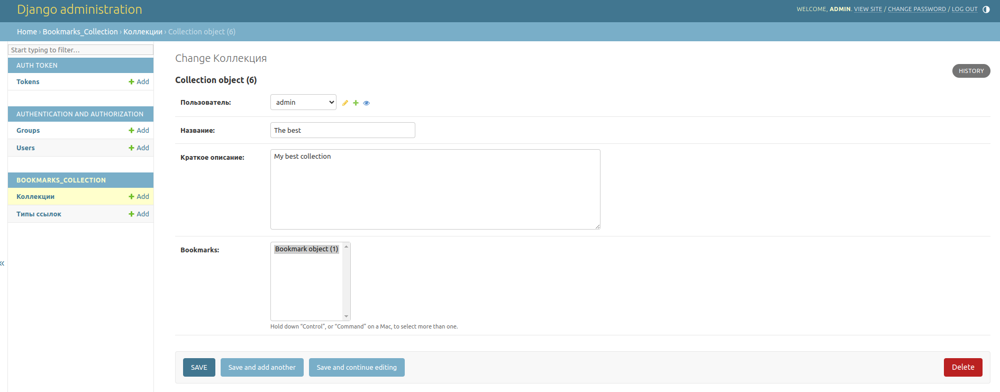
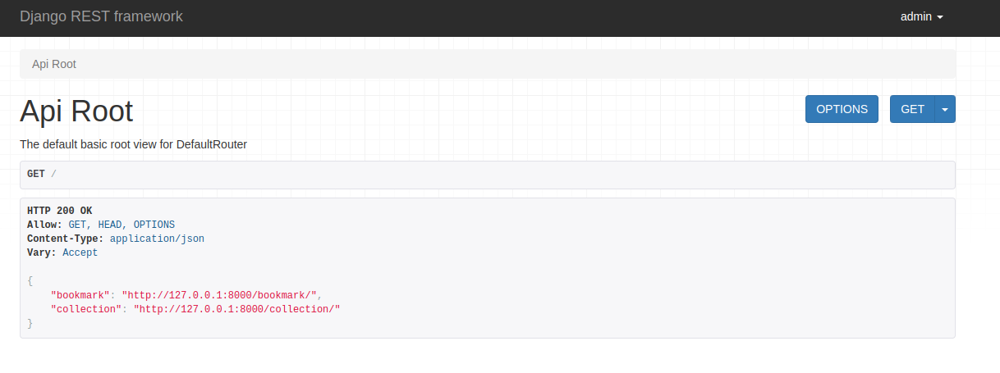
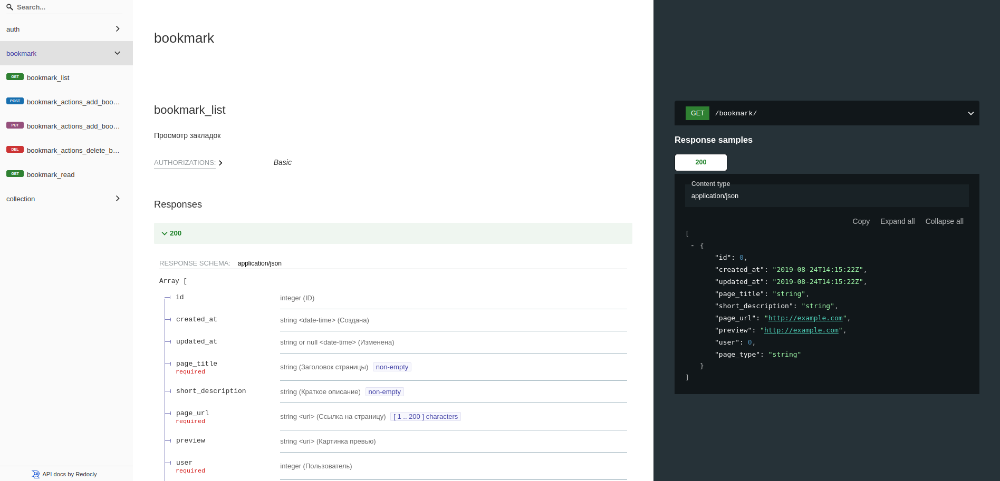
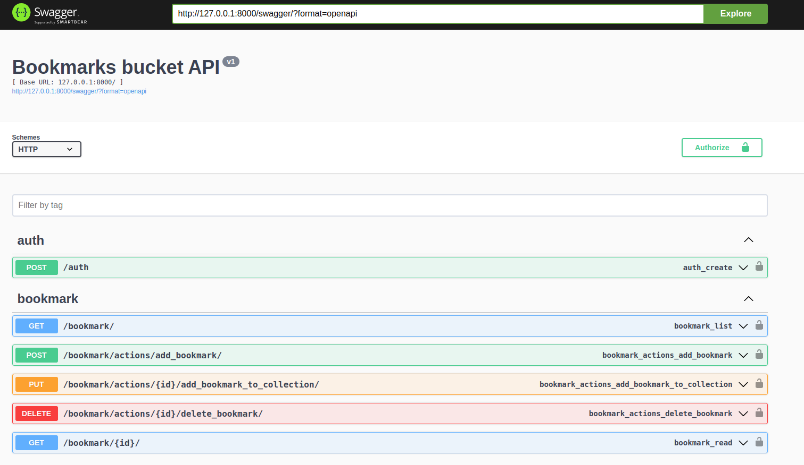
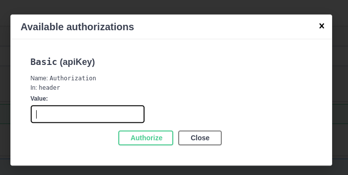

# Инструкция пользователя

---

## Административная часть

После настройки и запуска сервиса можно перейти по адресу `/admin`, авторизоваться там и выполнить некоторые настройки.

Авторизация в API построена на токенах. Каждому зарегистрарованному пользователю присваивается токен.
Это можно сделать в соответствующем разделе:

Также на странице администратора возможно управление типами контента.
При первом запуске сервиса справочник типов наполняется из констант.
Номенклатуру типов можно дополнять.
Изменять или удалять существующие не рекомендуется: это может негативно сказаться на работе сервиса.

Также на странице администратора есть альтернативная возможность управлять коллекциями пользователей.

## Пользовательская часть

Пользовательская часть представлена несколькими страницами

Ознакомиться с описанием API можно, перейдя в `/docs`

Опробовать работу API можно, перейдя в `/swagger`

Перед выполнением запросов необходимо авторизоваться: указать токен, назначенный пользователю.

Незарегистрированные пользователи не могут пользоваться сервисом.
Однако, сервис предоставляет API для регистрации пользователя.
Для регистрации необходимо указать email и пароль.
В системе будет создана учётная запись для пользователя,
а также будет выдан токен для доступа к API. Пользователь получит токен в ответном сообщении
после успешной регистрации.
